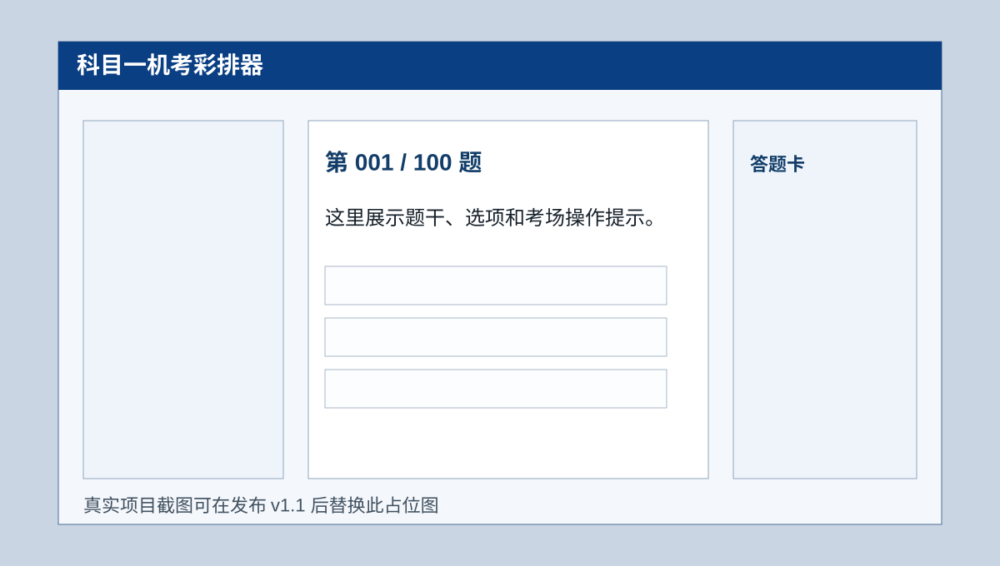

# 科目一机考彩排器

> 考前 10 分钟，提前熟悉科目一机考界面。

[在线试玩](https://tonyalbertwan.github.io/km1-exam-simulator/) · [反馈考场差异](https://github.com/TonyAlbertWan/km1-exam-simulator/issues) · Star 支持这个开源小工具

一个开源、免登录、可离线使用的科目一机考流程模拟器。它不和驾考宝典、元贝驾考拼题库，而是帮已经刷过题的考生提前熟悉考场电脑上的布局、倒计时、答题卡、确认本题、交卷弹窗和成绩报告。



## 适合谁

- 临考 1-3 天、已经刷过题但没见过考场电脑系统的 C1/C2 学员
- 想给学员演示机考流程的教练、驾校前台或朋友
- 想贡献题目样例、地区界面差异或考前流程经验的开源参与者

## 功能

- `全真彩排`：100题、45分钟、90分合格，交卷后统一回看解析
- `快速熟悉`：20题、10分钟，确认本题后立即显示答案和解析
- `界面导览`：5步高亮说明考生信息、倒计时、题目区、答题卡和交卷
- 彩排报告：成绩、合格状态、用时、正确/错误/未答、薄弱分类、错题回看
- 无构建、无后端、无登录，下载后双击 `index.html` 即可使用
- 自带基础 UT 和 CI，便于持续小步迭代

## 使用方法

直接双击 `index.html`，或在本目录启动静态服务器：

```bash
python -m http.server 8000
```

然后访问：

```text
http://localhost:8000/
```

开发检查：

```bash
npm test
```

## 项目边界

本项目不是官方考试系统，也不提供官方题库，不承诺题目命中率。内置题目是用于演示流程的原创示例题；正式备考请配合官方要求和正规刷题工具。

页面规则参考了公开机动车驾驶人考试规则与常见仿真页面：

- 小型汽车科目一常见规则：100题、45分钟、90分合格
- 题型以判断题、单项选择题为主
- 交卷前确认，时间到自动结束考试

## 题目数据格式

示例题位于 `data/questions.sample.js`。贡献题目时请保持字段稳定：

```js
{
  id: "sample-001",
  type: "single",
  category: "法律法规",
  difficulty: "easy",
  text: "题干",
  options: ["A选项", "B选项", "C选项", "D选项"],
  answer: 1,
  explanation: "解析",
  media: "speedLimit"
}
```

字段说明：

- `type`：`single` 或 `judge`
- `answer`：从 0 开始的正确选项下标
- `media`：可选，引用 `data/media.js` 中的图示键名
- `category`：用于结果页薄弱分类统计

## 文件结构

```text
.
├── index.html
├── styles.css
├── app.js
├── data/
│   ├── config.js
│   ├── media.js
│   └── questions.sample.js
├── src/
│   ├── engine.js
│   └── ui.js
├── tests/
│   └── engine.test.js
├── AGENTS.md
├── CONTRIBUTING.md
├── CHANGELOG.md
└── .github/
```

## Agent 协作

项目采用轻量 Agent 协作模型，详见 `AGENTS.md`。日常迭代按 PM Owner、Product Designer、Developer、QA/Growth 四个职责运行，目标是每天产出可验证的小改进、测试结果、提交哈希和下一步建议。

## Roadmap

- `v1.1`：在线 Demo、三模式彩排、彩排报告、贡献入口
- `v1.2`：题包导入、更多原创示例题、错题回看增强、地区界面反馈收集
- `v1.3`：摩托车/恢复资格模式、英文辅助模式、更多考场皮肤、可分享报告卡

## License

MIT
